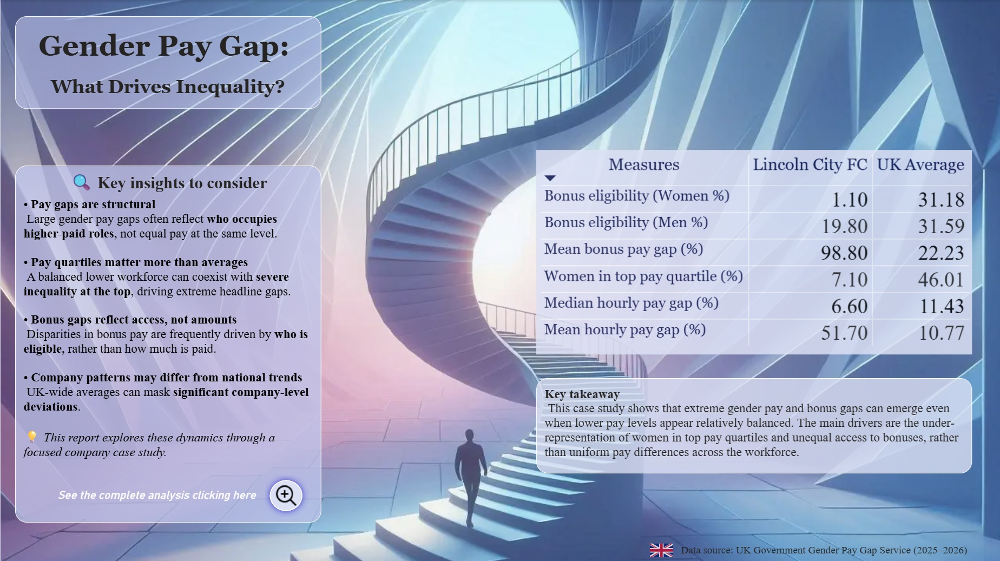
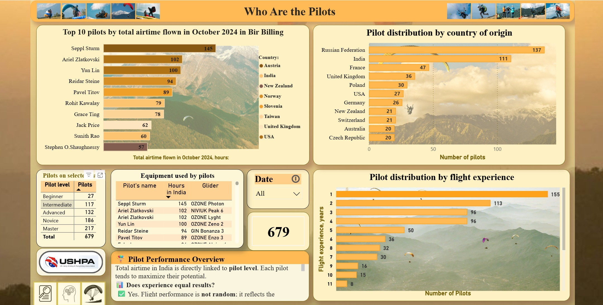
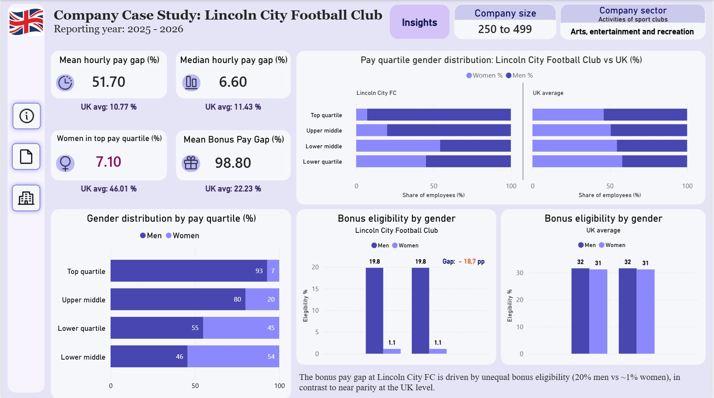

📊 I'm a **Data & Analytics Economist** with experience in procurement, supply chain–related analytics, and contract-focused operations within highly regulated environments. My background includes work in **centralized corporate procurement (Industry Procurement Directorate at Rosatom), government finance, and large-scale public procurement systems**.

🧠 I have hands-on experience in data analysis, reporting, and decision-support analytics using **Python, SQL, Power BI, and advanced Microsoft Excel**. I specialize in analyzing complex datasets, ensuring data integrity, and translating findings into clear, actionable insights for stakeholders and leadership.

🏛️ Previously, I worked with **government and enterprise procurement systems**, including centralized procurement platforms, electronic document management systems, and national public procurement portals. This strengthened my expertise in governance, compliance, risk-controlled environments, and cross-functional collaboration.

🎓 I hold a B.A. in Economics and a B.A. in Foreign Languages and continuously invest in professional development through certifications in Machine Learning, SQL, and Python for Data Analysis.

📈 My current focus is on data analytics, business intelligence, and analytical storytelling, with a strong interest in solving real-world operational and supply chain challenges with data.

🚀 I am particularly interested in roles at the intersection of analytics, operations, and supply chain, where well-designed metrics and structured analysis drive measurable business impact.

📫 **Let's Connect:**  
[LinkedIn](https://www.linkedin.com/in/cyberkalachik/)

## 📊 Portfolio Highlights

  
  
  

  
  
  

