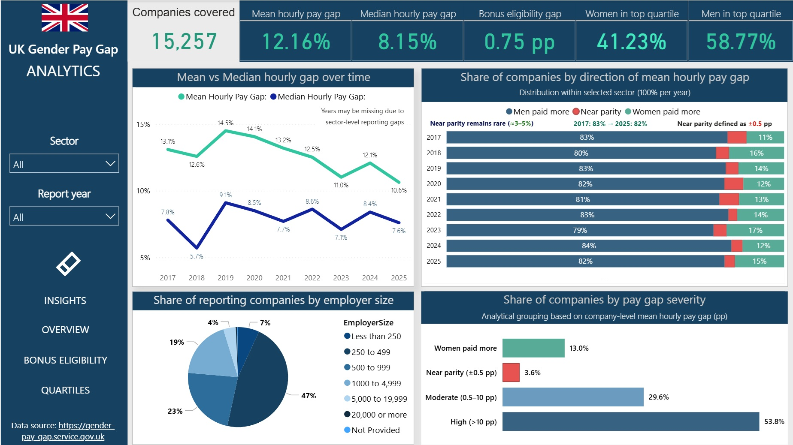
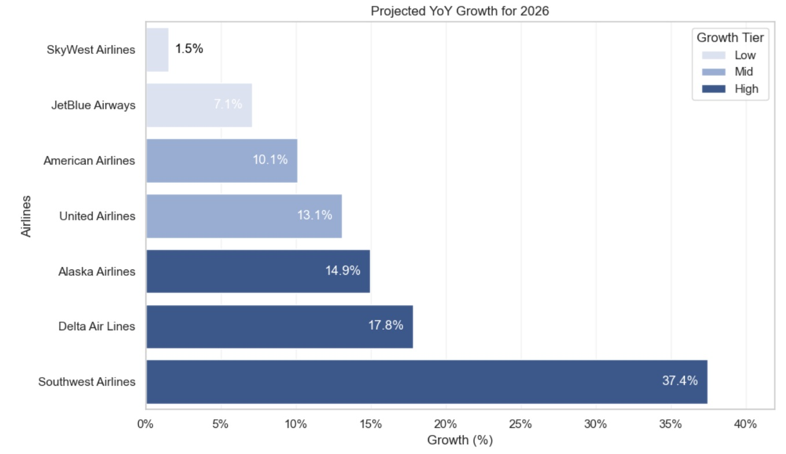
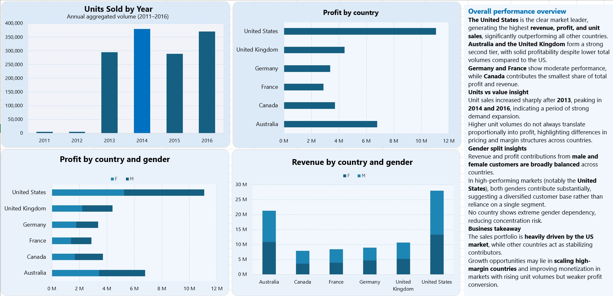

📊 I'm a **Data & Analytics Economist** with experience in procurement, supply chain–related analytics, and contract-focused operations within highly regulated environments. My background includes work in **centralized corporate procurement (Industry Procurement Directorate at Rosatom), government finance, and large-scale public procurement systems**.

🧠 I have hands-on experience in data analysis, reporting, and analytical support for decision-making, working extensively with **Python, SQL, Power BI, and advanced Microsoft Excel**. I am comfortable analyzing complex datasets, validating data integrity, and translating data into clear, actionable insights for stakeholders and management.

🏛️ Previously, I worked with **government and enterprise procurement systems**, including **centralized procurement platforms, electronic document management systems, and national public procurement portals**. This experience strengthened my understanding of process governance, compliance, and risk-controlled environments, as well as cross-functional collaboration across multiple organizations.

🎓 I hold a B.A. in Economics and a B.A. in Foreign Languages, and I continuously invest in professional growth through certifications in Machine Learning, SQL, and Python for Data Analysis.

📈 My current focus is on data analytics, business intelligence, and analytical storytelling, with a strong interest in applying data to real-world operational and supply chain challenges.

🚀 I am particularly interested in roles at the intersection of data analytics, operations, and supply chain, where well-designed metrics and structured analysis can drive measurable improvements.

- 📫 **Let's Connect**: [LinkedIn](https://www.linkedin.com/in/cyberkalachik/)

## 📊 Portfolio Highlights

Power BI dashboard
UK gender Pay Gap Single Page Report

Airline forecast

SQL/Excel dashboard

